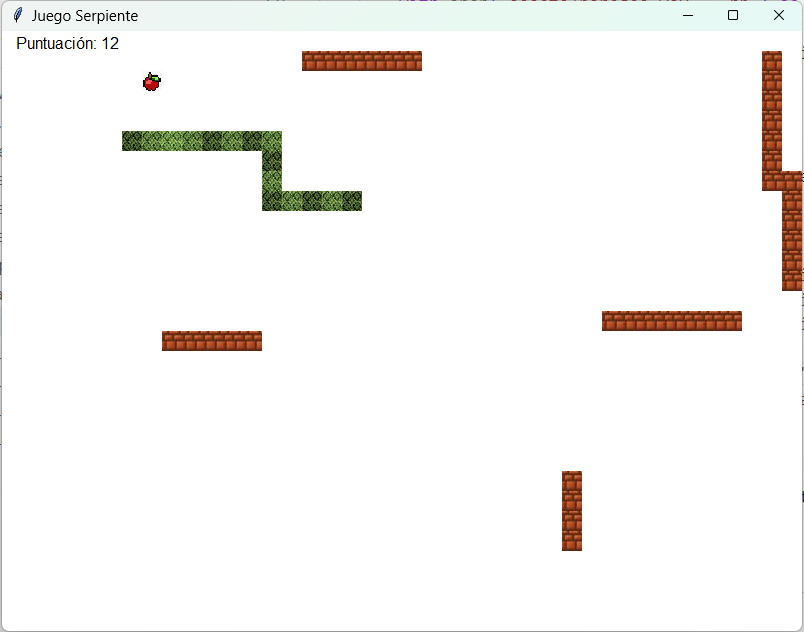
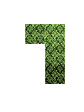
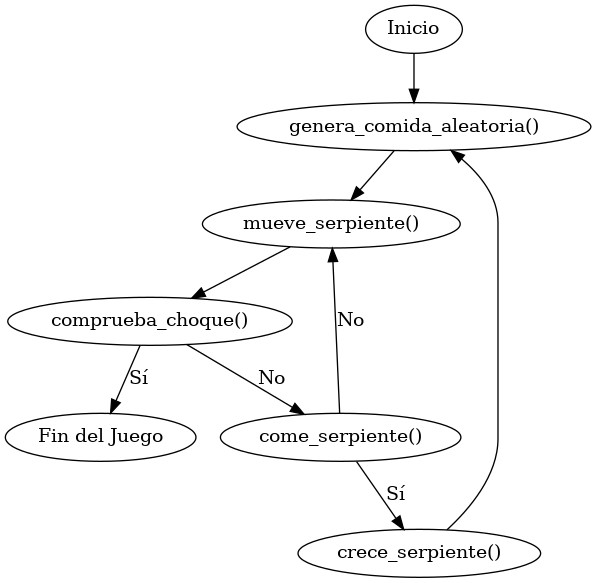
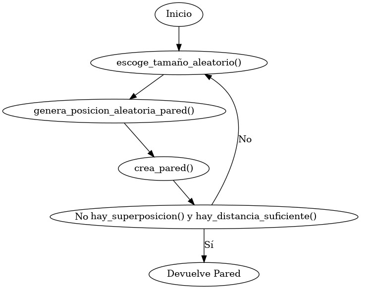

# Juego "Serpiente"

## Contexto
Se ha diseñado un juego Serpiente, y ya se dispone de la implementación de su interfaz gráfica en el módulo ``src/serpiente/gui.py``. Sin embargo, aún faltan por implementar algunas funciones encargadas de parte de la lógica de funcionamiento del juego. Estas funciones están especificadas en el módulo ``src/serpiente/utiles_serpiente.py`` y ``src/serpiente/utiles_paredes.py``

El objetivo del juego es manejar a la serpiente por el tablero de juego, intentando atrapar la comida, y evitando chocarse con las paredes o consigo misma. A medida que come, la serpiente irá creciendo. Además, el tablero de juego es circular, de manera que la serpiente puede salir por la izquierda y aparecer por la derecha, por ejemplo.



### Representación del tablero de juego

El tablero de juego está representado por una matriz de posiciones ``(columna, fila)``, de manera que la posición de la esquina superior izquierda sería la ``(0, 0)``. De esta manera, todos los elementos que se representan en el tablero (serpiente, comida y paredes) estarán compuestos de tuplas ``(columna, fila)`` indicando sus posiciones, como se explica a continuación.

### Representación de la serpiente

La serpiente está representada por una lista de posiciones de cada uno de los segmentos de su cuerpo. Cada posición es una tupla ``(columna, fila)``, o si entendemos el tablero como un plano, ``(x, y)``. Por ejemplo, esta serpiente:



que está compuesta por 4 segmentos y cuya cabeza (donde comienza el cuerpo) está abajo, estaría representada por la siguiente lista de tuplas (suponiendo que el último segmento del cuerpo de la serpiente estuviera en la esquina superior izquierda del tablero de juego):

```python
serpiente = [(1, 2), (1, 1), (1,0), (0,0)]
```

### Representación de la comida

La comida ocupa una única posición del tablero, y por tanto se representa mediante una tupla ``(columna, fila)`` que indica su posición

### Representación de las paredes

Cada pared del tablero de juego se representa de forma similar a la serpiente, mediante una lista de tuplas que indican las posiciones de cada segmento de pared.


## Objetivo

El ciclo principal de ejecución del juego es tal como se presenta en el siguiente diagrama:



**Implemente** las funciones que se observan en el diagrama en el módulo ``src/serpiente/utiles_serpiente.py``. Para cada función, se proporciona un comentario de documentación que indica claramente qué debe realizar la función, qué parámetros recibe, qué devuelve y, en su caso, si debe lanzar algún error bajo alguna circunstancia. También se incluyen ejemplos de casos de prueba, que puede utilizar para probar la función de manera interactiva. Para hacer esto, abra un terminal, ejecute el entorno python mediante los comandos ``python`` o ``ipython``, e importe las funciones del módulo mediante la sentencia ``from src.serpiente.utiles_serpiente import *``. A continuación, ejecute la secuencia de instrucciones indicadas en los tests, y observe si obtiene las salidas esperadas. Tenga en cuenta que algunas funciones tienen un carácter aleatorio, por lo que los resultados obtenidos pueden no ser exactamente los indicados en los casos de prueba.

Una vez considere que una función está correctamente implementada, ejecute el módulo ``src/serpiente/utiles_serpiente_test.py``, el cual probará exhaustivamente las implementaciones y le informará de si todas las pruebas son superadas con éxito. Si no supera alguno de los tests, **depure** su implementación con ayuda del depurador de Visual Studio Code. 

Una vez todas las funciones estén correctamente implementadas, debería poder ejecutar el juego mediante el módulo ``serpiente/gui.py``, y el juego debería ser completamente funcional, aunque no se generarán paredes. Use las teclas del cursor para desplazarse por el tablero de juego.

### Generación aleatoria de paredes

Las paredes que aparecen en el tablero de juego se generan aleatoriamente, para lo cual hay que escoger un tamaño, una posición y una orientación (vertical u horizontal). Para garantizar la jugabilidad, las paredes generadas no deben superponerse a otros elementos del juego (otras paredes, la comida o la serpiente), y en el momento de generarse deben estar a suficiente distancia de la serpiente, para dar tiempo al jugador a esquivarla, si se da el caso.

El proceso de generación de una pared aleatoria se resume en el siguiente diagrama:



**Implemente** las funciones que se observan en el diagrama en el módulo ``src/serpiente/utiles_paredes.py``. Finalmente, usando dichas funciones, implemente la función ``genera_paredes_aleatorias``, que se encarga de generar todas las paredes del tablero de juego. Igual que en la sección anterior, se proporciona un comentario de documentación para cada función, incluyendo casos de prueba, y un módulo de test para comprobar si la implementación es correcta (módulo ``src/serpiente/utiles_paredes_test.py``).

Una vez todas las funciones estén correctamente implementadas, debería poder ejecutar el juego mediante el módulo ``serpiente/gui.py``, y el juego debería ser completamente funcional, incluyendose en el tablero las paredes. 
